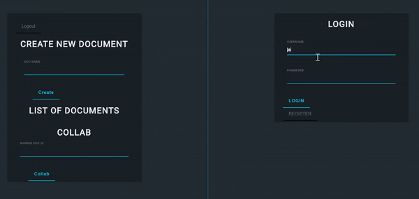
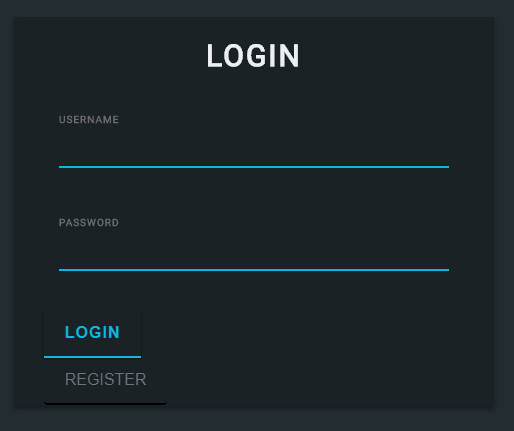

<div align='center'>
# Collab Me
A Collaborative Text Editor built with Draftjs built on top of [Electron](https://electronjs.org/)
</div>

<p align="center">


</p>

<div align='center'>
  
</div>
<!--  -->


<p align='center'>
  <a href="#key-features">Key Features</a> •
  <a href="#how-to-use">How To Use</a> •
  <a href="#project-goals">Project Goals</a> •
  <a href="#credits">Credits</a> •
  <a href="#contributing">Contributing</a>
</p>

----

## Key Features

* Passport - User Authentication
  - Hash protected usernames and passport
* Sync Text Collaborative Editing
  - While you type, socket connection allows for live text sync
* Document Ownership
  - Allows for document collaboration while also document ownership
* Word Search
* Toolbar for basic Markdown formatting
* Supports multiple cursors
* Cross platform
  - Windows, Mac and Linux ready.

## How To Use

To clone and run this application, you'll need [Git](https://git-scm.com) and [Node.js](https://nodejs.org/en/download/) (which comes with [npm](http://npmjs.com)) installed on your computer. From your command line:

```bash
# Clone this repository
$ git clone https://github.com/thejameswang/collab-me.git

# Go into the repository
$ cd collab-me

# Install dependencies
$ npm install

# Run the app
$ npm start

# For multiple development environment
# Create another terminal and repeat
$ npm start
```

This will get your development environment started

## Project Goals

1. Create an application using Electron as a basis
2. As a developer, create a platform for different users to communicate on the cloud.
3. Using packages and frameworks, Socket.io, Draft.js, Express.js, Node.js, React.js, Redux.js, and Mongoose ODM,
the goal became to utilize skills to develop a viable product.

## Display
  Login page

  

More [screenshots](docs/display.md)

## Credits

With these goals in mind, under the hood this project uses, among others:

* [Node.js](https://nodejs.org/):
  an open-source, cross-platform JavaScript run-time environment that
  executes JavaScript code server-side.
* [`socket.io`](https://github.com/socketio/socket.io):
  JavaScript library for realtime web applications. It enables realtime,
  bi-directional communication between web clients and servers.
* [`draft-js`](https://github.com/socketio/socket.io):
  a JavaScript rich text editor framework, built for React and backed by an immutable model.
* [`express`](https://github.com/expressjs/express):
  A web application framework for Node.js, released as free and open-source software under the MIT License. It is designed for building web applications and APIs.
* [`react`](https://github.com/facebook/react):
  A JavaScript library for building user interfaces. It is maintained by Facebook, Instagram and a community of individual developers and corporations.
* [`redux`](https://github.com/reactjs/redux):
  A predictable state container for JavaScript apps. Allows writing applications that behave consistently, run in different environments (client, server, and native), and are easy to test.
* [`electron-forge`](https://github.com/electron-userland/electron-forge):
  A complete tool for building modern Electron applications.
* [`electron-compile`](https://github.com/electron/electron-compile): a tool
  that lets you use modern and futuristic languages inside Electron without
  worrying about transpiling or build tooling.
* [`electron-rebuild`](https://github.com/electron/electron-rebuild):
  Automatically recompiles native Node.js modules against the correct
  Electron version.
* [Electron Packager](https://github.com/electron-userland/electron-packager):
  Customizes and bundles your Electron app to get it ready for distribution.

## Contributing

Pull requests are welcome. It may take time for the changes to be implemented, but
any contributions are appreciated.

Please make sure contributions are up to date with packages.
